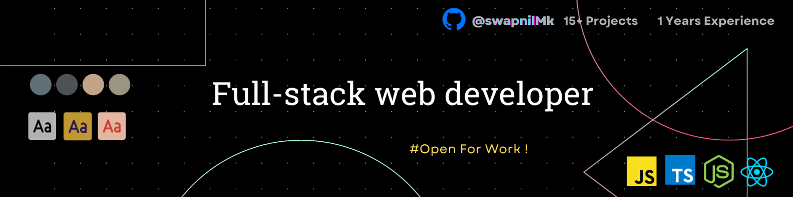

<h1 align='center'>

</h1>

<h3 align='center'>
  A passionate Frontend Developer from India 
</h3>

  

 

 

<h2 align="left">About me</h2>

###
🌍  I'm Swapnil, based in India, and I'm passionate about coding and technology.

🔭 I’m currently working on **<a href="https://github.com/SwapnilMk/techtea">Techtea</a>** 

💻 All of my projects are available at **[My Portfolio](https://swapy-portfolio.netlify.app/)**

💬 Ask me about **Frontend Development**

💗 Love to talk about **Research and Innovation!**
  
🧠  I'm actively learning and experimenting with JavaScript frameworks, with a particular focus on ReactJs. I'm excited about building interactive and dynamic web applications.works

🎯  My goals:    - Master Next.js and build production-ready applications with it.    - Contribute to open-source projects that align with my interests.    - Continuously improve my problem-solving and coding skills.  🎲  Fun fact: I'm an avid game enthusiast. When I'm not coding, you can often find me strategizing and having a great time playing games with friends and family.

🤝  I'm open to collaborating on interesting projects. If you have a project idea or need a hand, let's connect and make something great together!

✉️  Feel free to reach out to me at <a href="mailto:mswapnil218@gmail.com">mswapnil218@gmail.com</a>

###

<h2 align="left">I code with</h2>

###

  
  
  
  
  
  
  
  
  
  
  
  
  
  
  
  
  
  
  
  
  
  
  
  
  
  
  
  
  
  
  

###

### Socials

       

### Badges

<b>My GitHub Stats</b>

<b>Top Repositories</b>

       

### Support Me

